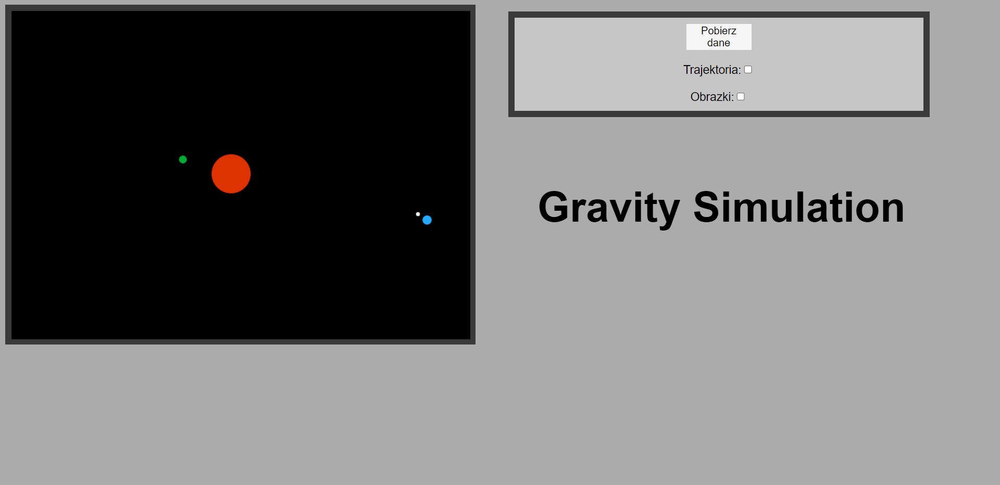
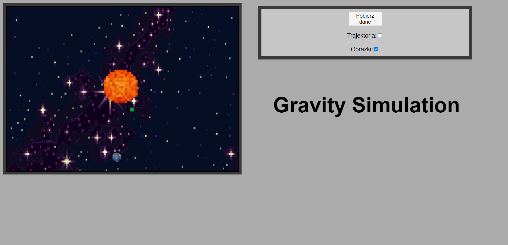

# Gravity Simulator

**Gravity Simulator** is a website where you can watch the impact of mass, velocity and position on the behavior of planets

**Images** are showing planets

**Trajectory** - you can see how planets are moving